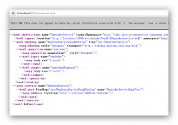

# CFX结合Spring开发webservice服务

1.下载CXF**：[http://cxf.apache.org/download.html](http://cxf.apache.org/download.html)

我下的是apache-cxf-2.7.12版，为方便cxf命令的使用，可以把bin目录安装到环境变量里面。

**2.添加jar**

必须加的jar主要有以下几个

cxf-2.7.12.jar

neethi-3.0.3.jar

xmlschema-core-2.1.0.jar

wsdl4j-1.6.3.jar

asm-3.3.1.jar

如果用jetty作为服务器，则必须加上jetty的相关包，我这里用tomcat作为服务器，所jetty包就可心不加了。

**3.创建接口**

新建一个接口，对这个接口加上@WebService注解，在接口内写上相关方法

```
import javax.jws.WebService;

@WebService
public interface ITestService{

     String sayHello(String usercode,String password);

}

```

 

**4.接口的实现**

对接口进行实现，同样加上webService注解，并且设置两个属性：endpointInterface和serviceName,

endpointInterface为接口的全包名，serviceName为服务的名字，自定义。

```
@WebService(endpointInterface="com.hello.service.ITestService" ,serviceName="TestService")
public class TestServiceImpl implements ITestService{

     @Override
     public String sayHello(String usercode, String password)  {

          System.out.println("Hello World");           

     }
}

```

**5.spring-config.xml中引入cxf的支持，配置访问的路径**

```
   <!-- 引入CXF的支持的文件,来源CXF的jar文件 -->
   <import resource ="classpath:META-INF/cxf/cxf.xml"/>                      \
   <import resource= "classpath:META-INF/cxf/cxf-extension-soap.xml" />   
   <import resource= "classpath:META-INF/cxf/cxf-servlet.xml" />  

   <!-- 描述相关的服务 address为访问时的路径-->     
   <jaxws:endpoint  id ="ws" implementor= "com.hello.service.impl.TestServiceImpl" address ="/test"></ jaxws:endpoint>

```

 

**6.web.xml中加CXFServlet**

```
 <servlet> 
   <servlet-name>CXFServlet</servlet-name> 
   <servlet-class>org.apache.cxf.transport.servlet.CXFServlet</servlet-class> 
 </servlet>

 <servlet-mapping>
   <servlet-name>CXFServlet</servlet-name>
   <url-pattern>/ws/*</url-pattern>
 </servlet-mapping>
```

 

**7.访问**：[http://localhost/ws/test?wsd](http://localhost/ws/test?wsdl)l   , 出现如下所示，则webService发布成功。



