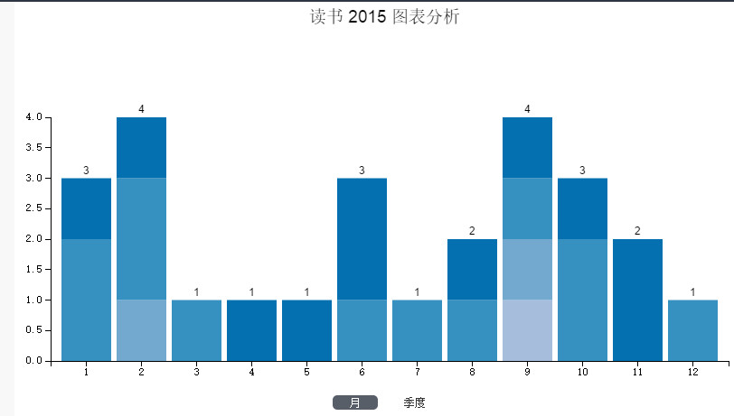

# 2015年所读书

标签（空格分隔）： life

---
15年是我有读书记录以来,读书最少的一年,共26本,原因种种,今年是个人的旅游元年,周末假期大大小小玩过的地方十来个,二来今年所读书多数偏向技术类,技术书都是砖块书,读起来费时间,当然挤压了我的大部分业余时间的,主要还是工作的繁忙,尤其是10月份以来,加班偏多,读书时间就更少了,不过欣慰的一点是,我已经连续七年,每月至少会扫荡掉一本书.

15年的读书方向开始转变,大学时期我的读基本都是社科文艺类,小说居多,毕业后一两年文艺类一半,技术类一半,直到今年,90%都是计算机技术类,2月的时候列过一个读书计划,基本上都是按计划走的,但中途我可能兴趣会有转移,或对一门技术特别感兴趣,就会改道读相关书籍,计划只是列个大致方向,不强求焉,biu~

01.《The PH.D. Grind》 Philip J. Guo 

02.《The Definitive Guide to Django》 Adrian Holovaty 

03.《学习vi和vim编辑器》 Arnold Robbins、Elbert Hannah、Linda Lamb 

04.《黑客:计算机革命的英雄》 Steven Levy 

05.《代码大全》 迈克康奈尔 

06.《重构:改善既有代码的设计》 Martin Fowler 

07.《Ubuntu权威指南》

08.《亲吻的艺术》威廉•凯恩

09.《无器械健身 : 用自身体重锻练》   马克·劳伦、乔舒亚·克拉克

10.《交换机.路由器.防火墙》  刘晓辉 

11.《1980年代的爱情》  野夫

12.《大型网站技术架构》  李智慧 

13.《Web全栈工程师的自我修养》  余果 

14.《构建高性能Web站点》  郭欣

15.《大型网站系统与Java中间件开发实践》  曾宪杰

16.《写给大家看的设计书（第3版）》  Robin Williams

17.《Java JDK 7学习笔记》  林信良 

18.《专业日式美发技巧-基础篇》 JFA

19.《HTTP权威指南》 David Gourley、Brian Totty 

20.《文学空间》 莫里斯.布朗肖 

21.《Practical Vim : Edit Text at the Speed of Thought》 Drew Neil 

22.《Pro Git》 Scott Chacon 

23.《编码 : 隐匿在计算机软硬件背后的语言》 Charles Petzold 

24.《软件随想录》 Joel Spolsky 

25.《Facebook效应》 大卫·柯克帕特里克

26.《西西弗神话》 加缪

