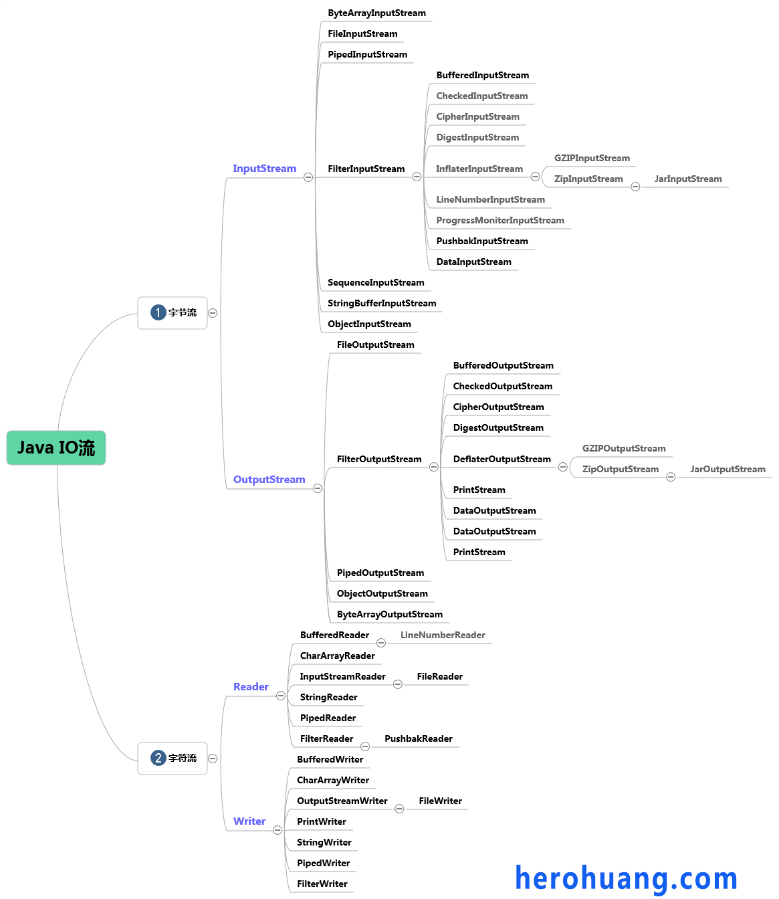

# Java IO 系列文章

标签（空格分隔）： java

---

- Java I/O之基本概念
- Java I/O之I/O框架体系
- Java I/O之InputStream与OutputStream
- Java I/O之Reader与Writer
- Java I/O之字节与字符的转化
- Java I/O之File类和RandomAccessFile类
- Java I/O之对象的序列化和反序列化
- Java I/O之使用Apache IO库
- Java I/O之设计模式的使用

---
# 概述

## 流
在`Java API`中,流的概念在`JDK1.0`中就存在了。简单的来说,流是一组有顺序的,有起点和终点的字节序列,是一个连续的数据流。`java.io`包下根据数据传输特性将流抽象为各种类,方便直观的进行数据操作。

## 输入输出
根据流向不同,可以从其中读入一个字节序列的对象称作`输入流`,可以向其中写入一个字节序列的对象称作`输出流`.其中输入输出的数据源和目标媒介可以是文件、管道、网络、内存、磁盘等。

## Java I/O的主要用途
`java.io`包下有大量的类，其中大部分类是`InputStream`、`OutputStream`、`Reader`、`Writer`的子类，针对不同业务场景选择使用相关类，这些类主要包含了一下功能：

- 文件访问
- 网络访问
- 内存缓存访问
- 线程内部通信(管道)
- 缓冲
- 过滤
- 解析
- 读写文本
- 读写基本类型数据
- 读写对象

## 流的分类

可以按以下三种方式来进行分类：

### 一：按流的方向
根据流的流动方向，可以分为输入流（`InputStream`）和输出流（`OutputStream`）。输入流只能从中读取数据而不能写入，输出流则相反。所有输入输出流的命名都以`InputStream`和`OutputStream`结尾。

### 二：按传输单位
根据对流的传输单位不同，可以将流分为`字节流(Byte Stream)`和`字符流(Character Stream)`。

- 字节流：字节流以字节(8bits)为单位进行读写。字节流的类都是`InputStream`和`OutputStream`类的子类。

- 字符流：字符流则以字符(16bits)为单位进行读写。字符流的类都是`Reader`和`Writer`类的子类，命名都以`Reader`和`Writer`结尾。字符流采用Unicode编码。

可以使用`InputStreamReader`和`OutputStreamWriter`将字节流转换为字符流。

### 三：按关联特点
根据数据源所关联的是数据源还是其它数据流，可以分为`节点流(Node Stream)`和`处理流(Processing Stream)`。

- 节点流：节点流是最基本的流，直接提供输入输出功能，一般用于直接从磁盘，内存等指定的位置进行读写操作。

- 处理流：处理流是高级的流，同节点流配合使用，一般用于对节点流或其它输入输出流进行封装，提供更丰富的输入输出功能。创建处理流时要将一个流对象作为参数来调用构造方法，且处理流可以嵌套使用。

```
InputStream in = new DataInputStream(
        new BufferedInputStream(
            new FileInputStream( “Source.txt” )
    )
)
```

## Java IO类库的基本架构

Java中的流主要分为两个层次结构，一个层次用于处理字节输入输出;另一个层次处理字符的输入和输出。比如，`InputStream`和`OutputStream`可以处理单个的字节和字节数组，要想读取字符串或数字，就要用到更强大的子类，如`DataInputStream`和`DataOutputStream`可以以二进制格式读取所有的基本Java类型。

下图列出了IO流的层次结构：



---

# 字节流：InputStream与OutputStream
对于数据流的读写操作，无论数据源或目的地为何，只要取得InputStream或OutputStream的实例，接下来操作输入 输出的方式其实都是大同小异的。

## 字节流基本方法
 - InputStream中的基本方法,用于从输入流中读取字节：

   ```
   read()
   read(byte b[])
   read(byte b[],int off,int len,)
   ```

 - OutputStream中的基本方法，用于将字节写入输出流：
 
    ```
    write(int b); 
    write(byte[] b); 
    write(byte[] b, int off, int len) 
    ```
    
## 字节流使用案例
下面用最基本的InputStream和OutputStream写一个通过的`flow`方法，将数据从数据源取出，写入目的地，代码如下：

```
   public class IOUtil {
       public static void flow(InputStream input, OutputStream output) throws IOException {
           byte[] data = new byte[4*1024];
           int length = -1;
           while ((length = input.read(data)) != -1) {
              output.write(data,0,length); 
           }
           input.close();
           output.close();
       }
   }
```

`flow`方法并不知道数据的真正来源和目的地是什么，而是使用的抽象的`InputStream`和`OutputStream`来接收，首先定义一个大小为[4*1024]的字节数组，然后用write方法从0开始，每次读取data多的数据,并且将读到的数据返回给length，一直到返回的结果为-1为止，-1代表数据读到了结尾，没有更多的数据了。
    
   - 使用`flow`方法只要传入具体的实现即可，比如实现读取`D://test.txt`并将其写入到`E://demo.txt`,则可以这样：
    
    ```
     IOUtil.flow(
        new FileInputStream(new File("D://test.txt")),
        new FileOutputStream(new File("E://demo.txt"))
     );
    ```
    
   - 如果要使用http抓取一个网页上的内容，保存到本地的`D://test.txt`文件中，是可以这样：
    
    ```
    URL url = new URL("http://www.herohuang.com");
    IOUtil.flow(url.openStream(),new FileOutputStream("D://test.txt"));
    ```
    
   - 如果要将文件输出至浏览器，则可以这样：
    
    ```
        @RequestMapping("/test")
        public void test(HttpServletRequest request, HttpServletResponse response) throws IOException {
            response.setContentType("application/pdf");
            InputStream is = request.getServletContext().getResourceAsStream("WEB-INF/test.pdf");
            OutputStream os = response.getOutputStream();
            byte[] data = new byte[1024];
            int length = -1;
            while ((length = is.read(data)) != -1) {
                os.write(data,0,length);
            }
        }
    ```
    
    通过以上案例可见，无论来源或目的地形式如何，只要想办法取得`InputStream`和`OutputStream`，接下来的操作都是调用`InputStream`和`OutputStream`的相关方法。
    

# 字符流：Reader与Write
在实际处理数据时，如果处理的是字符数据，使用`InputStream`和`OutputStream`就得对照编码表，在字符和字节之间进行转换，所以JAVA API提供了字符操作类，来简化了这种操作。

## 字符流基本方法

- Reader中的基本方法，用于从流中读取数据到字符数组：

    ```
    read(char[] cbuf); 
    read(char[] cbuf, int off, int len); 
    read(CharBuffer target); 
    ```
    
- Writer中的基本方法，用于把字符、字符数组写入流中：

	```
    write(char[] cbuf); 
    write(char[] cbuf, int off, int len); 
    write(int c); 
    write(String str); 
    write(String str, int off, int len); 
	```

## 字符流使用案例
同上，写一个通用的`dump`方法，从数据源以字符的形式读取数据，并写入到目的地，代码如下:

```
    public static void dump(Reader reader ,Writer writer) throws IOException {
        char[] data = new char[4 * 1024];
        int length = 0;
        while ( (length = reader.read(data) ) != -1) {
            writer.write(data,0,length);
        }
        reader.close();
        writer.close();
    }
```

如上，每次从`Reader`读入的数据,都会先置入`char`数组中。`Reader`的`read()`方法,每次会尝试读入`char` 数组长度的数据,并返回实际读入的字符数,只要不是-1,就表示读取到字符，然后使用`Writer`的`write()`方法来写入数据。

比如，用dump方法读取文档，转为字符串并打印出来，代码如下：、

```
    public static void main(String[] args) throws IOException{
        FileReader reader = new FileReader("D：//test.txt");
        StringWriter writer = new StringWriter();
        IOUtil.dump(reader,writer);
        System.out.println(writer.toString());
    }
```

`FileReader`读取字符时，不能自定义编码方式，而会使用JVM版本的默认的编码方式来处理字符，如果要自已设定编码，则可以使用`InputStreamReader`配合`FileInputStream`来代替`FileReader`：

```
 IOUtil.dump(
    new InputStreamReader(new FileInputStream("test.txt"),"UTF-8"),
    new OutputStreamWriter(new FileOutputStream("dest.txt"),"UTF-8"));
```

# 字节流和字符流的转换
如上面的例子，字节流和字符流之间可相互转换，可使用指定charset解码方式，转换的桥梁主要靠下面两个类：

- InputStreamReader：将输入的字节流转为字符流
- OUtputStreamWriter：将输出的字符流转为字节流

从字节到字符的解码过程，真正负责的类其实是`StreamDecoder`类，查看`InpuStreamReader`源码，可以发现它有一个`StreamDecoder`对象，在其`read`方法中，调用了`StreamDecoder`的read方法，


见下面的代码，
```
    public static void main(String[] args) throws IOException{
        FileInputStream input = new FileInputStream("/home/acheron/test.txt");
        //这里真正起作用的实际是StreamDecoder类
        InputStreamReader reader = new InputStreamReader(input,"UTF-8");

        /×× 以字符数组的方式读取发，放入buffer这个数组，
        从第0个位置开始，最多放buffer.length个
        返回的是读到的字符的个数 ×/
        char[] buffer = new char[4 * 1024];
        int d;
        while ((d = reader.read(buffer,0,buffer.length)) != -1) {
            //
            String s = new String(buffer,0,d);
            System.out.println(s);
        }
    }
```

# 序列化与反序列化

## 概念

- 序列化：将一个对象转换成字节序列的过程
- 反序列化：将一个字节序列重新构造成对象的过程

## 序列化的作用

- 把对象的字节序列永久保存到硬盘上
- 在网络上转送对象的字节序列

## 序列化反序列化的步骤
- 序列化：
1. 创建一个对象输出流`ObjectOutputStream`
2. 调用对象输出流的`writeObject()`方法写对象,将对象写入到输入流中
3. 关闭流
- 反序列化：
1. 创建一个对象输入流`ObjectInputStream`
2. 通过对象输入流的`readObject()`方法读取对象。
3. 关闭流

## Serializable接口
序列化接口Serializable接口没有方法或变量，仅用于标识可序列化的语义,Java类通过实现`Serializable`接口来启用序列化功能，如果对一个对象序列化时，该对象没有实现此接口，则会报`NotSerializableException`错误。
```
public class User implements Serializable {
    private String name;
    private Integer age;
    private String sex;

    @Override
    public String toString() {
        return name + "---" + age + "---" + sex;
    }
    ...
}
```

为什么实现`Serializable`接口就可以序列化，查看序列化的接口`ObjectOutputStream`源码，其中有`writeObject0`方法，可见如果被写对象的类型是String，或数组，或Enum，或Serializable，那么就可以对该对象进行序列化，否则将抛出NotSerializableException.
```
 if (obj instanceof String) {
        writeString((String) obj, unshared);
    } else if (cl.isArray()) {
        writeArray(obj, desc, unshared);
    } else if (obj instanceof Enum) {
        writeEnum((Enum<?>) obj, desc, unshared);
    } else if (obj instanceof Serializable) {
        writeOrdinaryObject(obj, desc, unshared);
    } else {
        if (extendedDebugInfo) {
            throw new NotSerializableException(
                cl.getName() + "\n" + debugInfoStack.toString());
        } else {
            throw new NotSerializableException(cl.getName());
        }
    }
```
    


## 序列化和反序列化案例

如下代码，对`User`类进进序列化和反序列化操作
```
    public static void main(String[] args) throws IOException, ClassNotFoundException {
        //序列化User类,保存到test.txt文件中
        ObjectOutputStream out = new ObjectOutputStream(new FileOutputStream("D://test.txt"));
        User user = new User("herohuang.com",20,"man");
        out.writeObject(user);

        //反序列化，读取test.txt，转为user对象
        ObjectInputStream in = new ObjectInputStream(new FileInputStream("D://test.txt"));
        User user1 = (User)in.readObject();
        System.out.println(user1.toString());
    }
```

## transient关键字
`transient` 关键字的作用是控制变量的序列化，在变量声明前加上该关键字，可以阻止该变量被序列化到文件中，在被反序列化后，`transient`变量的值被设为初始值，如 int 型的是 0，对象型的是 null。可以参考`ArrayList`的源码，`elementData`就是`transient`修饰的。

## 序列化ID
虚拟机是否允许反序列化，不仅取决于类路径和功能代码是否一致，一个非常重要的一点是两个类的`序列化ID`是否一致

```
 private static final long serialVersionUID=1L
```

## readObject和writeObject方法
如果一个变量被`transient`修饰，是否有其它方法让它可以被序列化，可以通过`readObject`和`writeObjet`方法来实现。比如在user类中加入这两个方法。
```
public class User implements Serializable {
    private String name;
    transient private Integer age;
    private String sex;

    private void writeObject(ObjectOutputStream out) throws IOException {
        out.defaultWriteObject();
        out.writeInt(age);
    }

    private void readObject(ObjectInputStream in) throws IOException, ClassNotFoundException {
        in.defaultReadObject();
        age = in.readInt();
    }
    
    ...
}
```
在writeObject()方法中会先调用ObjectOutputStream中的defaultWriteObject()方法，该方法会执行默认的序列化机制，此时会忽略掉age字段。然后再调用writeInt()方法显示地将age字段写入到ObjectOutputStream中。必须注意地是，writeObject()与readObject()都是private方法，那么它们是如何被调用的呢?可见ObjectOutputStream中的writeSerialData方法，以及ObjectInputStream中的readSerialData方法,可知是使用反射。

## Externalizable接口
JDK中提供了另一个序列化接口`Externalizable`，使用该接口之后，之前基于Serializable接口的序列化机制就将失效。并且心须重写`writeExternal`和`readExternal`方法。
```
public class User implements Externalizable {

    ...
    public User() {
       System.out.println("none-arg constructor");
    }
        
    @Override
    public void writeExternal(ObjectOutput out) throws IOException {
        out.writeObject(name);
        out.writeInt(age);
    }

    @Override
    public void readExternal(ObjectInput in) throws IOException, ClassNotFoundException {
        name = (String) in.readObject();
        age = in.readInt();
    }
}
```
`Externalizable`继承于`Serializable`，当使用该接口时，序列化的细节需要由程序员去完成。并且，实现Externalizable接口的类必须要提供一个无参的构造器，且它的访问权限为public。 

---

# Apache IO

`Apache Commons IO`是Apache基金会创建并维护的Java函数库,它提供了许多类使得开发者的常见任务变得简单，同时减少重复代码。`Apache Commons IO`主要包括以下六个部分：

- 工具类——使用静态方法执行共同任务
- 输入——用于InputStream和Reader实现
- 输出——用于OutputStream和Writer实现
- 过滤器——各种文件过滤器实现
- 比较器——各种文件的Java.util.Comparator实现
- 文件监听器——监听文件系统事件的组件

具体使用可以参考以下资料：

- 官网：http://commons.apache.org/proper/commons-io/
- 资料：https://www.javacodegeeks.com/2014/10/apache-commons-io-tutorial.html
- 资料：http://www.07net01.com/2015/07/876032.html
- iteye: http://ray-yui.iteye.com/blog/2023034


参考资料:
- 《深入分析Java Web技术内幕》许令波
- 《Java编程思想》
- 《Java核心技术卷2》
-  http://www.jikexueyuan.com/course/215_1.html
-  http://www.imooc.com/learn/123
- http://www.2cto.com/kf/201312/262036.html
- http://blog.csdn.net/yczz/article/details/38761237
- http://freejavaguide.com/corejava-io.pfd
- https://segmentfault.com/a/1190000000740793
- http://ifeve.com/java-io/
- http://www.infoq.com/cn/articles/cf-java-i-o

- http://www.htbenet.cn/zaixianjiaocheng/java/748.html

- 官网：http://commons.apache.org/proper/commons-io/
- 资料：https://www.javacodegeeks.com/2014/10/apache-commons-io-tutorial.html
- 资料：http://www.07net01.com/2015/07/876032.html
- iteye: http://ray-yui.iteye.com/blog/2023034


---


# File类的使用
`File`类中的方法主要分为以下四种:

- 文件名相关方法

    getAbsoluteFile() 
    getAbsolutePath()
    getName() 
    getParent()
    getParentFile()
    getPath() 
    renameTo(File dest)
    
- 文件状态相关方法

    exists()
    canExecute()
    canRead()
    canWrite() 
    isFile()
    isDirectory() 
    isAbsolute()(UNIX/Linux中是否以/开头) 
    isHidden() 
    lastModified()
    length()

- 文件操作

createNewFile()
createTempFile(String prefix, String suffix)
delete()
deleteOnExit() 
setExecutable(boolean executable) 
setReadOnly()

- 目录操作

mkdir() 
mkdirs() 
list()
list(FilenameFilter filter) 
listFiles()
listFiles(FileFilter filter) 
listRoots()

具体方法请参考[JDK文档](http://docs.oracle.com/javase/8/docs/api/).


