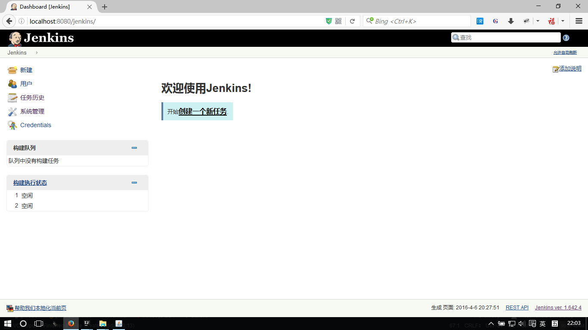
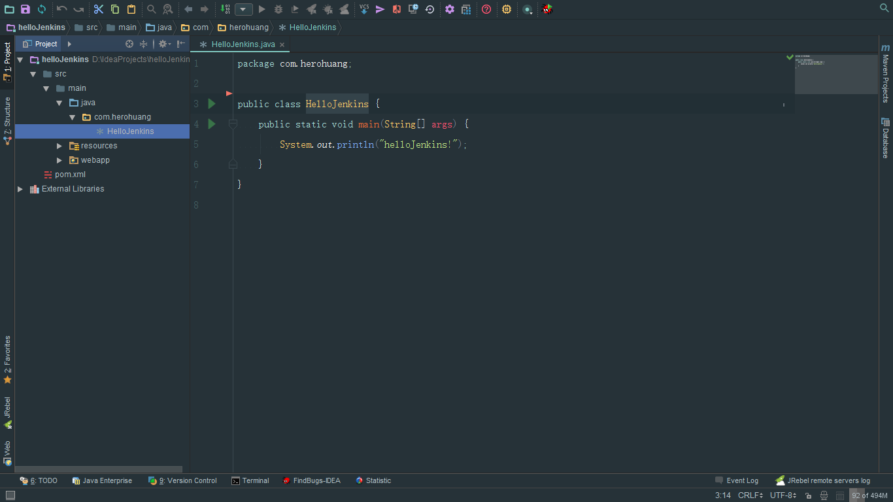
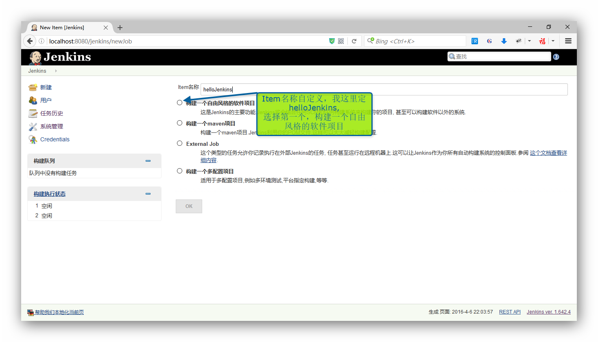
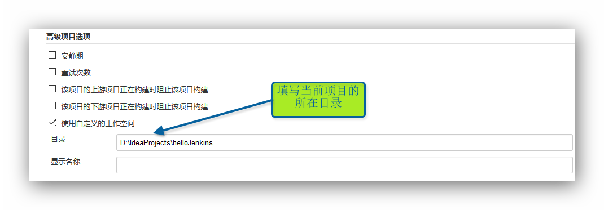
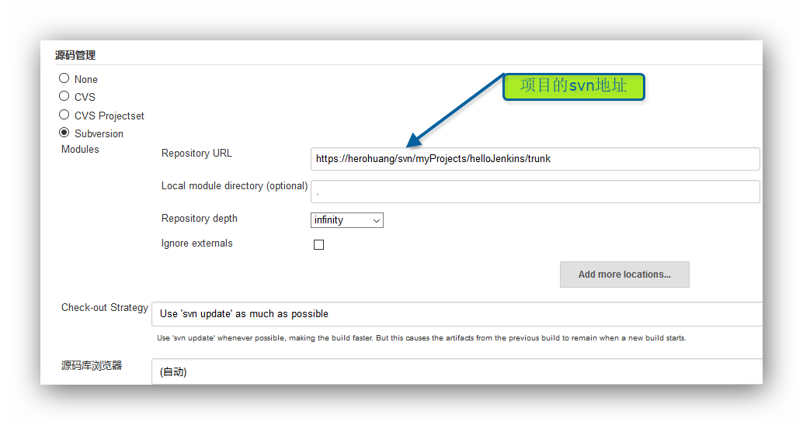
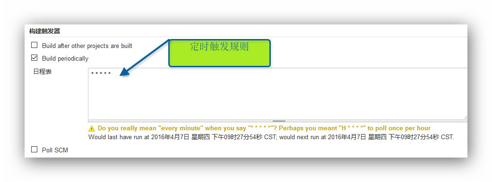
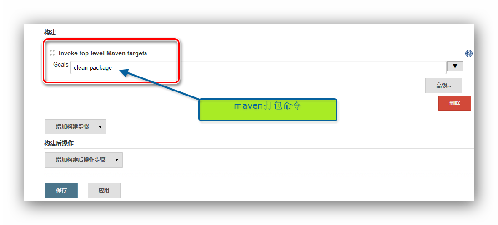
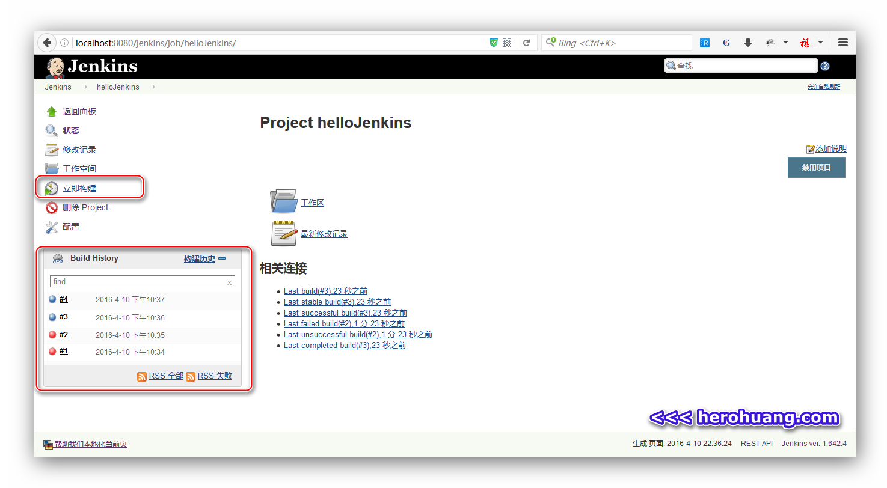
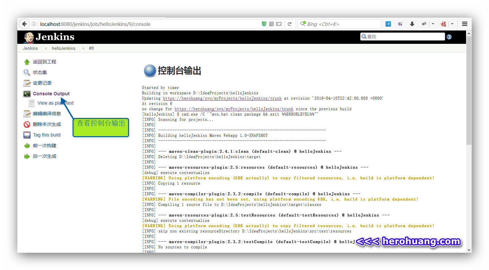

# 持续集成：Jenkins+maven+svn+IntelliJ IDEA                                   

# 本文初衷
- 记录我在本地机上搭建持续集成的过程
- 了解Jenkins的基本使用
- 工作过的公司都没有使用持续集成，所以我没有这方面的使用经验。

# 持续集成是什么

- 维基百科：[https://en.wikipedia.org/wiki/Continuous_integration](https://en.wikipedia.org/wiki/Continuous_integration)
- 百度百科：[http://baike.baidu.com/view/5253255.htm](http://baike.baidu.com/view/5253255.htm)
- 网络文章：[http://www.ruanyifeng.com/blog/2015/09/continuous-integration.html](http://www.ruanyifeng.com/blog/2015/09/continuous-integration.html)
- 网络文章：[https://www.zhihu.com/question/23444990](https://www.zhihu.com/question/23444990)
- 提出者 **Grady Booch**：[https://en.wikipedia.org/wiki/Grady_Booch](https://en.wikipedia.org/wiki/Grady_Booch)
- 相关书籍：[《持续集成:软件质量改进和风险降低之道》](https://book.douban.com/subject/2580604/),[《持续交付：发布可靠软件的系统方法》](https://book.douban.com/subject/6862062/)

# 持续集成工具有哪些
    
- **Jenkins**:[https://jenkins.io/](https://jenkins.io/)
- Hudson:[http://www.eclipse.org/hudson/](http://www.eclipse.org/hudson/)
- Travis CI:[https://travis-ci.org](https://travis-ci.org)
- Strider:[https://github.com/Strider-CD/strider](https://github.com/Strider-CD/strider)
- Codeship:[https://codeship.com/](https://codeship.com/)
- Bamboo:[https://www.atlassian.com/software/bamboo](https://www.atlassian.com/software/bamboo)
- TeamCity:[https://www.jetbrains.com/teamcity/](https://www.jetbrains.com/teamcity/)
- CruiseControl:[http://cruisecontrol.sourceforge.net/](http://cruisecontrol.sourceforge.net/)
- **其它工具**：[http://www.oschina.net/project/tag/344/ci](http://www.oschina.net/project/tag/344/ci)
- **工具对比**：[http://cristal.iteye.com/blog/482658](http://cristal.iteye.com/blog/482658) 

# 所使用到的工具

本文主要演示在Windows环境下，以`Jenkins`来搭建Java开发持续集成环境，除`Jenkins`以外，用到的其它工具有以下：

- 系统：Windows10
- tomcat:[http://tomcat.apache.org/](http://tomcat.apache.org/)
- Maven：[http://maven.apache.org/](http://maven.apache.org/)
- svn:[http://subversion.apache.org/](http://subversion.apache.org/)
- IntelliJ IDEA:[https://www.jetbrains.com/idea/](https://www.jetbrains.com/idea/)

# Jenkins简单入门

官网有详细的文档：
- Jenkins简介：[https://wiki.jenkins-ci.org/display/JENKINS/Meet+Jenkins](https://wiki.jenkins-ci.org/display/JENKINS/Meet+Jenkins)
- Jenkins使用：[https://wiki.jenkins-ci.org/display/JENKINS/Use+Jenkins](https://wiki.jenkins-ci.org/display/JENKINS/Use+Jenkins)

网络好文：
- [http://blog.csdn.net/leijiantian/article/details/7916483](http://blog.csdn.net/leijiantian/article/details/7916483)
- [http://www.cnblogs.com/zz0412/p/jenkins02.html#_Jenkins%E6%8F%92%E4%BB%B6](http://www.cnblogs.com/zz0412/p/jenkins02.html#_Jenkins%E6%8F%92%E4%BB%B6)

## 一. 下载和运行
访问[Jenkins](https://jenkins.io/)官网，下载对应系统的安装包，我用得是windows10,下载后为一个war包： `jenkins.war`,要启动Jenkins，主要有两种方式，一种是在cmd中运行以下命令：

```
java -jar jenkins.war
```

另一种是用web服务器来启动,将`jenkins.war`包放于tomcat的webapps目录下,启动tomcat即可。

我用tomcat来启动，启动成功后，打开浏览器访问`http://localhost:8080/jenkins`即可进入jenkins配置页面，如下图：


Jenkins启动成功后，在`C:\Users\username\`下会有一个`.jenkins`文件夹，用于存放Jenkins的任务，插件，配置等信息。

## 二. 创建第一个任务
在Jenkins中创建第一个任务这前，先在IntelliJ IDEA中建一个Maven项目:`helloJenkins`，并将上传至svn中:` https://herohuang/svn/myProjects/helloJenkins/trunk`。


接着点击`创建一个新任务`，进入如下所示页面，`Item名称`随便取，这里我取为`helloJenkins`，下面选择第一个选项，构建一个自由风格的软件项目。


## 三. 进入配置界面
进入当前项目配置的详细页面，假设现在要执行的构建动作是使得`helloJenkins`项目定时期自动打成war包，则需要在这个页面的以下几个地方作配置：

### 1. 高级项目选项
高级项目选项，选择`使用自定义的工作空间`，目录填写当前项目所在的本地目录，显示名称可以不填。
 

### 2. 源码管理
我用的是svn，所以这里选择`Subversion`，`Repository URL`填写项目的svn地址，其它默认。


### 3. 构建触发器
构建触发器有三种方式，我选择`Build periodically`表示定时地触发构建，`日程表`填写定时的规则，使用`crontab`表达式，为了方便测试，这里我填`* * * * *`，注意中间有空格，表示每隔一分种就构建一次。


### 4. 构建
构建的方式，因为我用得是`maven`，这里选择`Invoke top level Maven targets`,`Goals`填写maven命令：`clean package`打包项目。


### 5. 查看构建结果
根据上面设置的规则，每隔一分种就会自动构建一次，在左侧栏下的`Build History`面板可以看到构建历史，或则点击立即构建来查看结果。


点击某个构建版本，进入可查看详细的构建结果

如果构建成功，则在项目目录下会发现多出一个target目录(编译目录设为此目录),其中会有maven`clean package`命令生成的war包。

---
>
```
本文标题:持续集成：Jenkins+maven+svn+IntelliJ IDEA
文章作者:[Acheron](http://www.herohuang.com)
发布时间:2016年04月10日 - 20时48分
最后更新:2016年04月10日 - 20时52分 
许可协议: "署名-非商用-相同方式共享 3.0" 转载请保留原文链接及作者。
```
