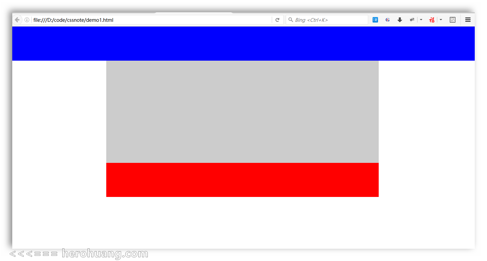
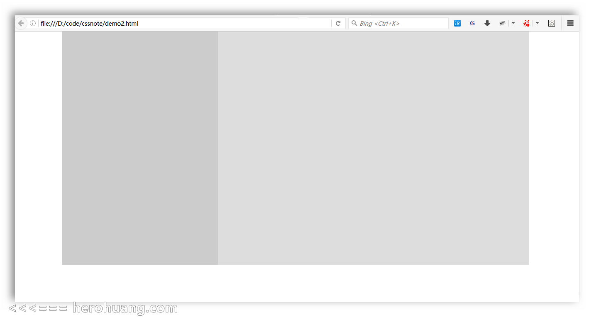

#网页布局：CSS实现一列二列三列和混合布局

## 常见网站布局
网站常见的布局方式主要有一列布局，二列布局，三列布局和混合布局。

## 一列布局
### 效果图：

### 代码：
- CSS:
```
    body{margin:0;padding: 0;}
    .top{height:100px;background: blue;}
    .main{width:800px;height:300px;background: #ccc;margin:0 auto;}
    .foot{width: 800px;height:100px;background: red;margin: 0 auto;} 
```
- HTML:
```
    <div class="top"></div>
    <div class="main"></div>
    <div class="foot"></div>
```
- 说明：
页面中有三块`div`，头底和中间内容部分，三部分都设置了固定的高度，顶部的宽度不设置，在实际开发中`main`部分一般不设置固定高度，而是可随着内容的多少而多高，比如[新浪网](http://www.sina.com.cn/)。

## 二列布局
### 效果图：

### 代码：
- CSS：
```
body{margin:0;padding: 0;}
.main{width:600px;margin:0 auto;}
.left{width: 200px;height:300px;background: #ccc;float:left;}
.right{width:400px;height:300px;background: #ddd;float:right;}

```

- HTML:
```
<div class="main">
	<div class="left"></div>	
	<div class="right"></div>
</div>

```
- 说明：
二列布局的宽高一般是固定的，所以一般外面再套一层`main`,用这个`main`来固定宽高。

## 三列布局
### 效果图：

### 代码：
- CSS：
```
body{margin:0;padding: 0;}
.left{width: 200px;height:500px;background: #ccc;position:absolute;left: 0;top: 0;}
.middle{background: blue; height: 500px;margin:0 200px 0 200px;}
.right{width:200px;height:500px;background: red;position: absolute;right: 0;top: 0;}

```
- HTML:
```
<div class="left"></div>	
<div class="middle">sdfsdfsdfsdfsdf</div>
<div class="right"></div>

```
- 说明：
三列布局，让`left`绝定定位到左侧，`right`绝定定位到右侧,中间不设宽度，则可以随浏览器自适应，这里要用`absolute`的方式来定位，用`float`难以实现。

## 混合布局
### 效果图：

### 代码：
- CSS：
```
body{margin:0;padding: 0;}
.top{height:100px;background: blue;}
.head{height: 100px;width: 800px;background: #f60;margin: 0 auto;}
.main{width:800px;height:300px;background: #ccc;margin:0 auto;}
.left{width:200px;height: 300px;background: #eee;float: left;}
.right{width:600px;height: 300px;background: #369;float: right;}
.foot{width: 800px;height:100px;background: red;margin: 0 auto;}

```
- HTML:
```
<div class="top">
	<div class="head"></div>
</div>
<div class="main">
	<div class="left"></div>
	<div class="right"></div>
</div>
<div class="foot"></div>

```
- 说明：
常见网站的布局都是混合布局，上面的混合布局例子在原先的一列布局上做了修改，在`main`下划分了左右块，`top`下加了`head`块。可以根据需要，在`left`或`right`块下再划分为其它块。
