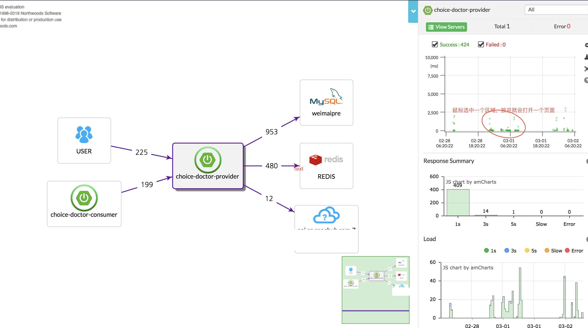

# 分布式跟踪工具Pinpoint技术入门

[TOC]

## 本文初衷
因为工作需要，这周研究了一下APM（Application Performance Management）相关技术，看了些许资料，对比了各种技术的特点，最终选择Pinpoint作为性能监控工具，本文的主要目的是记录本人部署Pinpoint的过程。
## Pinpoint是什么
简单的说，[Pinpoint](https://github.com/naver/pinpoint)是一款对Java编写的大规模分布式系统的APM工具，有些人也喜欢称呼这类工具为`调用链系统`、`分布式跟踪系统`。我们知道，前端向后台发起一个查询请求，后台服务可能要调用多个服务，每个服务可能又会调用其它服务，最终将结果返回，汇总到页面上。如果某个环节发生异常，工程师很难准确定位这个问题到底是由哪个服务调用造成的，Pinpoint等相关工具的作用就是**追踪每个请求的完整调用链路，收集调用链路上每个服务的性能数据**，方便工程师能够快速定位问题。
## 同类工具
- google的[Dapper](https://static.googleusercontent.com/media/research.google.com/zh-CN//pubs/archive/36356.pdf)  [中文翻译](http://bigbully.github.io/Dapper-translation/)
- twitter的[Zipkin](http://zipkin.io/)
- 淘宝的鹰眼（EgleEye）
- 大众点评的[CAT](https://github.com/dianping/cat)  [CAT的安装和配置](http://www.herohuang.com/2017/02/22/dianping-cat/)

## 为什么要用Pinpoint
最重要的原因，对代码的零侵入，运用JavaAgent字节码增强技术，只需要加启动参数即可。

## Pinpoint架构图

（图片出处：官网）
架构说明：
-  Pinpoint-Collector：收集各种性能数据
-  Pinpoint-Agent：和自己运行的应用关联起来的探针
-  Pinpoint-Web：将收集到的数据显示成WEB网页形式
-  HBase Storage：收集到的数据存到HBase中

## 开始部署

前提条件
- maven 3.2.x+
- git
- java 6+

### 0. 开始
- 下载：git clone https://github.com/naver/pinpoint.git
- 进入Pinpoint目录后编译：mvn install -Dmaven.test.skip=true
- 如果不想自己手动打包，则可以在这里直接下载打包好的。[下载](https://github.com/naver/pinpoint/releases/tag/1.6.0)

### 1. 部署Hbase
Pinpoint以Hbase作为数据的存储。
- 下载Hbase：http://apache.mirror.cdnetworks.com/hbase/
- 解压后编辑：`conf/hbase-env.sh,`添加JAVA_HOME配置：，在27行左右：
```
export JAVA_HOME=/Library/Java/JavaVirtualMachines/jdk1.8.0_121.jdk/Contents/Home
```
- 编辑hbase-site.xml：
```
<configuration>
    <property>
        <name>hbase.rootdir</name>
        <value>file:///Users/acheron/Tmp/hbase</value>
    </property>
     <property>
         <name>hbase.zookeeper.property.dataDir</name>
        <value>/Users/acheron/Tmp/zookeeper</value>
    </property>
    <property>
      <name>hbase.zookeeper.property.clientPort</name>
        <value>2182</value>
  </property>
</configuration>
```
这样配置是本地单实例模式启动，上面配置分别表示：数据存放地点、zookeeper数据存放地点、zookeeper端口号（默认2181）。**当然这个文件可以不配置，那么会采取默认值**。

启动hbase的时候，hbase用得是自带的zk，在hbase的配置里可见 export HBASE_MANAGES_ZK=true；

- 进入hbase/bin目录启动hbase：./start-hbase.sh
- 用`jps`命令查看Hbase是否启动成功，如果启动成功的会看到"HMaster"的进程
- 初始化pinpoint需要的表，在bin目录下执行：./hbase shell /opt/data/hbase-create.hbase  (这里的hbase-create.hbase在源码`pinpoint/hbase/scripts/hbase-create.hbase`)
- 访问页面测试是否成功：http://localhost:16010/master-status  ，如果成功在页面的tables标签下能看到导入的表。
- 也可以用命令来查看是否导入表成功，进入hbase，输入"status 'detailed'"可以查看初始化的表
```
./hbase shell
status 'detailed'
```

### 2. 部署Pinpoint-collector
- 将pinpoint-collector-1.6.0-SNAPSHOT.war放到tomcat-collector-8086/webapps/下，并重命名为ROOT.war
- 启动tomcat，配置ROOT/WEB-INF/classes/hbase.properties:
```
hbase.client.host=localhost
hbase.client.port=2181
```
指向zookeeper的地址和端口，如果是本机，端口默认，则这里不需更改。
- 配置上面后，重启tomcat（*端口8086*）
- 如果./startup.sh启动tomat没权限：chmod u+x *.sh 

### 3. 部署Pinpoint-web
Pinpoint-web的配置和Pinpoint-collector相似：
- 将pinpoint-web-1.6.0-SNAPSHOT.war放到tomcat-web-8085/webapps/下，并重命名为ROOT.war
- 启动tomcat，配置ROOT/WEB-INF/classes/hbase.properties:
```
hbase.client.host=localhost
hbase.client.port=2181
```
指向zookeeper的地址和端口，如果是本机，端口默认，则这里不需更改。
- 配置上面后，重启tomcat（*端口8085*）

### 4. 部署Pinpoint-agent
- 新建目录：mkdir pp-agent
- 将pinpoint-agent-1.6.0-SNAPSHOT.tar.gz 拷贝到pp-agent目录并解压
- 配置pinpoint.config：profiler.collector.ip=127.0.0.1
  这是指pinpoint-collector的地址，如果是同一服务器，则不用修改。其它默认。
- 安装pinpoint-collector启动后，自动就开启了9994，9995，9996的端口了，这里默认即可。如果有端口需求，要去pinpoint-collector的配置文件("pinpoint-collector/webapps/ROOT/WEB-INF/classes/pinpoint-collector.properties")中，修改这些端口。

### 5. 部署TestApp
- 官方提供了一个测试用的应用，pinpoint-quickstart-testapp-null.war，将其重命名为ROOT.war，部署到tomcat-testapp-8084
- 修改此tomat的`/bin/catalina.sh`，在106行左右加入启动参数：
```n
CATALINA_OPTS="$CATALINA_OPTS -javaagent:/Users/acheron/pinpoint/pp-agent/pinpoint-bootstrap-1.6.0.jar"
CATALINA_OPTS="$CATALINA_OPTS -Dpinpoint.agentId=myapp"
CATALINA_OPTS="$CATALINA_OPTS -Dpinpoint.applicationName=MyTestPP"
```
第一行：pinpoint-bootstrap-1.6.0.jar的位置

第二行：这里的agentId必须唯一,标志一个jvm。

第三行：applicationName表示同一种应用：同一个应用的不同实例应该使用不同的agentId,相同的applicationName。

### 6. springboot包部署

如果是jar包部署，直接在启动命令加启动参数：
```
nohup java -javaagent:/Users/acheron/pinpoint/pp-agent/pinpoint-bootstrap-1.6.0.jar -Dpinpoint.agentId=acheron-consumer -Dpinpoint.applicationName=acheron-consumer -jar myapp.jar &
```

### 7.效果演示
hbase和各应用都启动成功之后，访问Pinpoint-web，效果如下：


## 结束语

各大APM工具，几乎都是根据google这篇经典的Dapper论文而来，一定要读一读。这里是它的源文地址：https://research.google.com/pubs/pub36356.html，感谢这位同学的翻译：http://bigbully.github.io/Dapper-translation/

## 参考文章

- [Dapper，大规模分布式系统的跟踪系统](http://bigbully.github.io/Dapper-translation/)
- [Pinpoint - 应用性能管理(APM)平台实践之部署篇](https://sconts.com/11)
- [有什么知名的开源apm(Application Performance Management)工具(知乎)](https://www.zhihu.com/question/27994350)
- [分布式跟踪系统调研](http://www.zenlife.tk/distributed-tracing.md?utm_source=tuicool&utm_medium=referral)
- [pinpoint安装与配置](http://www.ltang.me/2016/11/29/pinpoint-installing/)
- [pinpoint安装部署](http://www.cnblogs.com/yyhh/p/6106472.html#yy02)
- [官网翻译](https://skyao.gitbooks.io/leaning-pinpoint/content/)