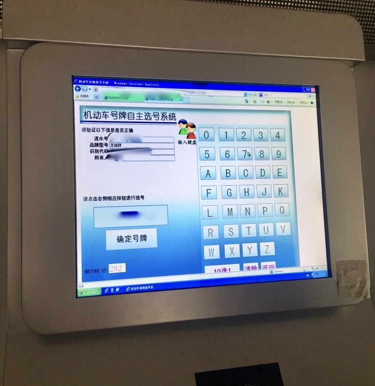

# 买车记-我是怎么买车的

> Acheron  2017-07-23 本文地址：

[TOC]

## 一、摇号

### 1.1 怎么摇号

申请参加摇号可以在`杭州市小客车总量调控管理信息系统`,网址：[http://xkctk.hzcb.gov.cn/](http://xkctk.hzcb.gov.cn/)，注册账号，注册的时候要填写驾驶证等信息，注册成功后即成功参加下期摇号了，杭州摇号每个月一次，每次26号公布，能够参加县指标的人每年会有两次额外的机会，上半年3月份，下半年10月，报名期间，同样登录此网站，"是否参加县（市）摇号",选择是即可，也就是说，如果有县指标申请资格，一年一共有14次摇号机会。

### 1.2 怎么查询摇号结果

主要有以下几种途径：

- 第一种：登录上述的`杭州市小客车总量调控管理信息系统`网站查看，如果中签，申请状态会显示：**获得指标**

- 第二种：因为注册时会填写手机号，中签的话会收到短信提醒，没收到则没中。本人中签短信内容如下：

  > 【杭州小客车调控办】【某某】您获得【某某市】县（市）摇号【201704】期小客车增量指标！请您及时登录杭州市小客车总量调控管理信息系统网站（ http://xkctk.hzcb.gov.cn/）查询中签结果。此为提醒短信，具体以网站查询结果为准。

- 第三种：直接百度搜索`杭州摇号结果查询`，在`摇号信息查询`中输入姓名或要好申请编号进行查询

- 第四种：微信关注公众号`杭州交通`，进行查询

###  1.3 指标有效期
*指标的有效期为6个月，如果逾期没有使用的，视为放弃指标，并在指标有效期届满次日起2年内不得申请增量指标。*

## 二、了解汽车

在买车之前，我对汽车完全不了解，因为我总觉得汽车的知识属于信息类知识，很多东西只要知道，了解就可以了，在理解的层面会少一点，也就是说对于汽车相关知识我只要花点时间突击一下，就能知道个大概了。于是，在一个多月的时间里，我开始去了解汽车，看书，看车评节目，看汽车类网站，上下班的路上，遇到不认识的汽车，就拿出手机查查，看看各种参数，一段时间，脑子里塞满了车子，近乎走火入魔了，在对脑子进行一阵汽车的狂轰乱炸之后，我对汽车的理解开始丰满起来，才意识到以前是多么的片面。汽车涉及到知识繁多，及其复杂，开车可能学个几天就会了，但真正要认识汽车，没有几年的沉淀，基本不可能。

### 2.1 看书

为了快速了解汽车相关的理论知识，我用一个多月的时间读完了以下10本书,两本印象最为深刻，第一本《汽车为什么会跑》，这本书可以说是神书，图文并茂，文字简明，将汽车的内部结构全部做剖视图，读来毫不费力,看完之后，对汽车的主要结构基本有了一个大致的了解，发动机的工作原理，变速器的工作原理，汽车地盘的构成等等。第二本，《驾车养车常识速查速用大全集》，这本书内容比较全面，看完这本书，你就可以跟人吹牛逼了，比如汽车是怎么分类的，A级/B级/C级等怎么区分，涡轮增压和自然吸气的区别是什么，怎么开车省油啊等等各种问题，应有尽有。

- 《汽车为什么会“跑”》陈新亚
- 《如此购车最聪明》陈新亚 
- 《大画汽车》陈新亚
- 《名车标志和识别》陈新亚
- 《战后的奇迹日本车》吴远
- 《汽车是怎样跑起来的》［日］ 御堀直嗣 
- 《跑车的荣耀》叶宏
- 《如此开车最聪明》陈新亚
- 《汽车为什么有电》刘汉涛
- 《驾车养车常识速查速用大全集》车行天下

### 2.2 车评节目
国内的车评节目，我只推介看8哥的《38号车评中心》，专业，客观，独立，所谓国内只有两档车评节目，《38号车评中心》和其它。以下是我看过的：
- 38号美系性能控：《38号车评中心》:[链接](http://i.youku.com/i/UMTUxMTg3NjU0MA)
- 颜宇鹏：《YYP新车评》[链接](http://www.xincheping.com/video/)
- 李老鼠：《李老鼠说车》[链接](http://i.youku.com/u/UMzA3ODE3NjcxNg==)
- 胖哥：《胖哥车评》[链接](http://news.auto.sina.com.cn/video/panggeshiche/)
- 陈震：《萝卜报告》[链接](http://i.youku.com/u/UMTcwODYxMDY1Mg==)
- 初晓敏：《车若初见》《晓敏auto秀》
- 闫闯：《闫闯说车》[链接](http://i.youku.com/i/UMzMwOTU4NjEwMA==?spm=a2hzp.8253869.0.0)
- 轼界：[链接](http://www.yizhibo.com/member/personel/user_info?memberid=28564937)

### 2.3 品牌官网

曾经我对那些看见大路上开过一辆车，就能说出车的品牌型号价格的人，很是羡慕。其实，这实在太简单了，快速了解车品牌的方式就是上车的官网，看多了就记住了，常见的也就那么几种。

- 本田：[http://www.honda.com.cn/](http://www.honda.com.cn/)
- 大众：[http://www.vw.com.cn/cn.html](http://www.vw.com.cn/cn.html)
- 丰田：[http://toyota.com.cn/](http://toyota.com.cn/)
- 马自达：[http://www.mazda.com.cn/](http://www.mazda.com.cn/)
- 日产：[http://nissan.com.cn/](http://nissan.com.cn/)
- 宝马：[www.bmw.com.cn](www.bmw.com.cn)
- 奔驰：[http://www.mercedes-benz.com.cn/](http://www.mercedes-benz.com.cn/)
- 奥迪：[http://www.audi.cn/](http://www.audi.cn/)
- 福特：[https://www.ford.com.cn/](https://www.ford.com.cn/)
- 别克：[http://www.buick.com.cn/](http://www.buick.com.cn/)
- 现代：[https://www.hyundai.com/](https://www.hyundai.com/)
- 吉利：[http://www.geely.com/](http://www.geely.com/)
- 吉普：[http://www.jeep.com.cn/](http://www.jeep.com.cn/)
- 路虎：[http://www.landrover.com.cn/](http://www.landrover.com.cn/)
- 雪佛兰：[http://www.chevrolet.com.cn/](http://www.chevrolet.com.cn/)
- 英菲尼迪：[http://www.infiniti.com.cn/](http://www.infiniti.com.cn/)
- 沃尔沃：[http://www.volvocars.com/zh-CN](http://www.volvocars.com/zh-CN)
- 特斯拉：[https://www.tesla.cn/](https://www.tesla.cn/)
- 雷克萨斯：[http://www.lexus.com.cn/](http://www.lexus.com.cn/)
- 劳斯莱斯：[http://www.rolls-roycemotorcars.com.cn/](http://www.rolls-roycemotorcars.com.cn/)
- 凯迪拉克：[https://www.cadillac.com.cn/](https://www.cadillac.com.cn/)
- 法拉利：[https://www.ferrari.com/zh-CN](https://www.ferrari.com/zh-CN)
- 保时捷：[http://www.porsche.com/china/](http://www.honda.com.cn/)
- 兰博基尼:[https://www.lamborghini.com/cn-en/](https://www.lamborghini.com/cn-en/)

### 2.4 汽车网站

要了解有哪些车型，还可以上汽车网站，我浏览过的主要有以下几个。其中，国外的`美国消费者报告`,是最权威专业的，各种车型的测试报告都可以在这里找到。国内的`汽车之家`，有一个比较常用的功能就是可以选择不同车后进行对比，各种参数一目了然，除了这个功能有用点，其它不是广告，就是水文，就不值得看了。手机上我主要用`易车网`的`汽车报价大全`，当然都仅限于看参数。

- 国外：
    - [美国消费者报告](http://www.consumerreports.org/)
    - [What car](https://www.whatcar.com/)
    - [Auto news](http://www.autonews.com/)
    - [Motortrend](http://www.motortrend.com/)
    - [Car driver](http://www.caranddriver.com/)
    - [Motor Authority](http://www.motorauthority.com/)
- 国内：
    - [汽车之家](http://www.autohome.com.cn/)
    - [新车评](http://www.xincheping.com/)
    - [易车网](http://www.yiche.com)

### 2.5 汽车赛事

- 勒芒24小时耐力赛:[维基百科](https://zh.wikipedia.org/wiki/%E5%8B%92%E8%8A%9224%E5%B0%8F%E6%97%B6%E8%80%90%E5%8A%9B%E8%B5%9B),[官网](http://www.lemans.org/)
- 一级方程式赛车(F1):[维基百科](https://zh.wikipedia.org/wiki/%E4%B8%80%E7%BA%A7%E6%96%B9%E7%A8%8B%E5%BC%8F%E8%B5%9B%E8%BD%A6),[官网](http://www.formula1.com/)
- A1GP汽车大奖赛:[维基百科](https://zh.wikipedia.org/zh-hans/A1GP%E6%B1%BD%E8%BD%A6%E5%A4%A7%E5%A5%96%E8%B5%9B)
- WRC世界拉力锦标赛:[维基百科](https://zh.wikipedia.org/wiki/%E4%B8%96%E7%95%8C%E6%8B%89%E5%8A%9B%E9%94%A6%E6%A0%87%E8%B5%9B)
- WTCC世界房车锦标赛:[官网](https://www.fiawtcc.com/)
- 达喀尔拉力赛:[维基百科](https://zh.wikipedia.org/wiki/%E8%BE%BE%E5%96%80%E5%B0%94%E6%8B%89%E5%8A%9B%E8%B5%9B)

### 2.6 汽车车展

- 巴黎车展
- 北京车展
- 北美车展
- 东京车展
- 法兰克福车展
- 日内瓦车展
- 上海车展

## 三、去4S店买车

### 3.1 选车
在对车有了大致的了解之后，接下来就是选车了。当然，大多数人了解车的途径很少是像我这种方式，他们一般是问身边有车的朋友亲戚，别人推荐什么 ，就考虑什么 。选车，一定要从自己的需求出发，不管是实用需求，装逼需求，不人云亦云，别人的意见也只能是参考。比如，我一开始看中的是本田CR-V,也没有什么具体原因，仅仅是因为一开始想买SUV，而别人推荐过这车,先入为主的影响，导致我一段时间没考虑过其它车辆，随着了解的汽车的深入，我才转变想法，接下来我又对以下车辆有过考虑：帕萨特--高尔夫--昂克赛拉--雅阁。经过一段时间的`见异思迁`之后，我才终于正视自己的需求，我列了如下几个关键字：
- 合资
- 价格<=20W：
- A级车
- 适合年轻人的第一辆车
- 空间、油耗都还可以

有了这几个需求之后，能被选择的车辆其实不多了，然后具体对每辆车参数性能深入对比，一辆辆排除，最终才选择了第十代思域(难道不是因为外形漂亮?-_-……..)。

### 3.2 定车
在去4S店之前，内心就应该已经选好了车，并具对要看的车优缺点都有了解，相关参数也基本知道，去4S店只是为了试试真车。选好车，交定金，签合同，约定提车时间，接下来就是等待提车了。

定车的时候，就要交定金签合同了，定金一般2000到5000，签合同要注意的几点是，要确定销售人员答应的服务都要写明在合同上，比如送车玻璃险，送灭火器等等，保障起见，切勿口头约定。其他销售人员推荐的，要加钱的各种服务，一概不要。

买一辆车，要花费的钱主要如下：总费用(落地)=车价+保险+购置税+其他，车价可以参考官方指导价，有很多车是有优惠的，少则几千，多则几万，当然还有思域这种奇葩，不仅没优惠，而且还加价五千。。。保险要看你买的种类，一般6千多，购置税多少跟车有关，比如思域，购置税是8900多，其他的费用比如办理临时牌照费，自己办理15元，4S店代办50元（坑），上牌费120，等等。

### 3.3 提车
提车当天，因为要办理临时牌，所以要工作日，带上合同，钱，大致流程如下：
1. 检查车：主要检查哪些方面，在上面提到的书《驾车养车常识速查速用大全集》有写
2. 办临时牌，第一次办理临时牌，我是让4S店代办的,自己在店里等即可,或自己去车管所办理
3. 办理保险，第一年保险，在4S店办理，可自己选择种类，太平洋保险、平安保险等,可刷信用卡,无手续费
4. 交车款,刷刷刷
5. 开车上路,恭喜开始走上老司机之路

## 四、上牌
### 4.1 上牌注意

上牌要注意的二点：

1. 在去车管所之前，一定要确定已经交了购置税，我就是直接开车去了车管所，结果资料没带齐不给办，又跑到审批中心办理购置税，来回浪费了时间。
2. 到车管所时，要先把车开到新车检验区，检验完后有《机动车查验记录表》，然后再去大厅里叫号办理其它事项。

### 4.2 上牌资料
办理牌照需要带上如下资料：
- 《身份证原件和复印件》
- 《机动车销售统一发票》注册登记联：提车的时候4S店给
- 《机动车销售统一发票》发票联：提车的时候4S店给
- 《机动车查验记录表》  ：车管所新车检验区检查后给
- 《小客车增量指标个人指标证明文件（摇号）》
- 《机动车交通事故责任强制保险单》：上保险的时候给

### 4.3 选车牌号
终于来到激动人心人时刻了，在上面程序都办理好之后，就可以选车牌号了，在车管所大厅里有专门的选号机器，其实就是一个web站点，留下的能够被选的号基本上都是不易记的，大都带4字，界面如下:

选好号之后，交钱130，其中行驶证办理120元，临时牌照10元，之后在窗口等待行驶证即可。牌照不是当天就能给你的，会快递到你的邮寄地址，拿到牌照后，一前一后，自己装上即可。

## 五 、倒车图解

我虽然驾驶证已经7年了，但我平时根本没机会开车，当年教练教的也忘光了。所以我还是个驾驶新手，开新车的前两天，明显很大的不适应，尤其是倒车停车，很少一次停正。下面这两张关于停车的图是在上面提到的书《如此开车最聪明》中读到的，给了我很大帮助：

